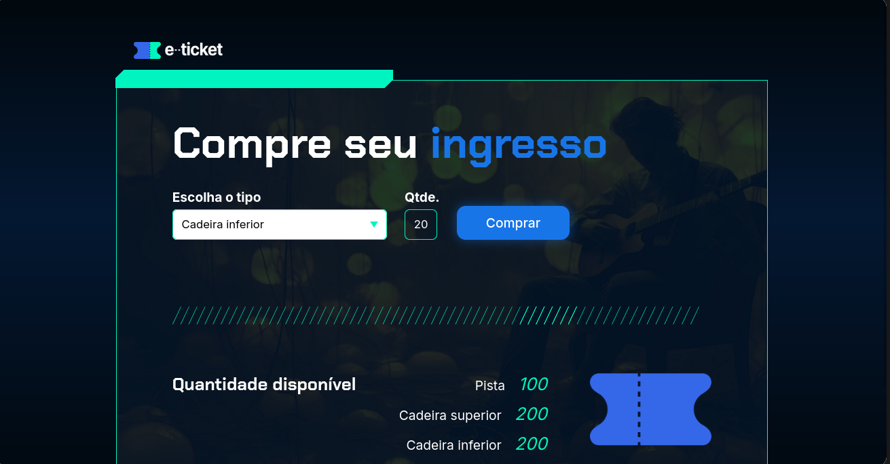
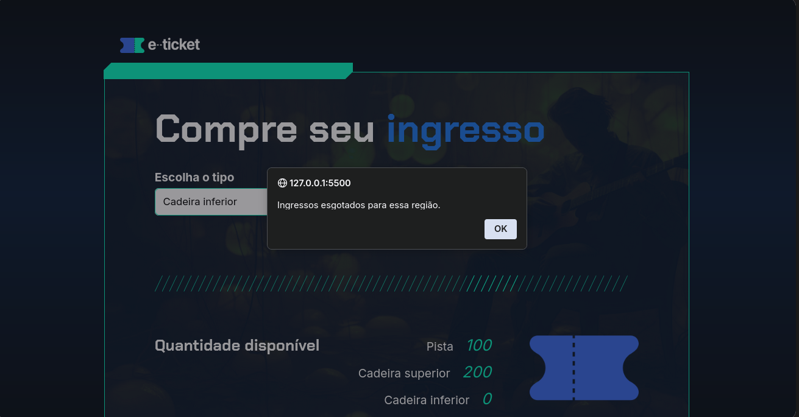

## Desafio de lógica de programação com JavaScript

Tecnologias utilizadas: 
* Javascript (ES6) 
* HTML5
* CSS3

O intuito do desafio é simular compras de ingressos online - mostrando as quantidades disponíveis para compra em cada região e restringindo o usuário 
de comprar caso não haja mais ingressos.

 
 

### Demonstração do projeto

Aqui podemos visualizar a quantidade de ingressos disponíveis para compra em cada setor
 

  
E também podemos ver a restrinção para o usuário caso não haja mais ingressos disponíveis. 

